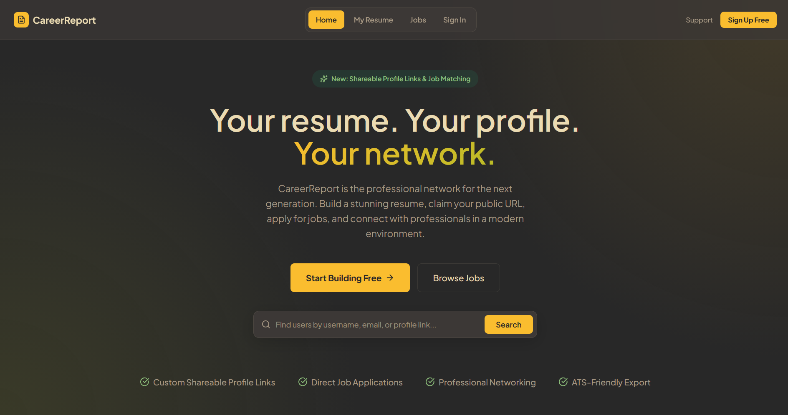

# CareerReport

<p align="center">
  
</p>

<p align="center">
  <strong>CareerReport</strong> is a state-of-the-art professional networking platform and resume builder designed for the next generation. Build stunning, pixel-perfect, ATS-friendly resumes, claim your custom public profile, and network in a sleek, business-first environment.
</p>

<p align="center">
  <a href="#-core-innovations"></a>
  <a href="#-tech-stack"></a>
  <a href="#-testing-architecture"></a>
</p>

<p align="center">
  
</p>

---

## 🚀 Core Innovations & Recent Accomplishments

### 🤖 1. Invisible ATS & AI Metadata Layer (`AtsMetadata.tsx`)
Stunning, heavily styled, and multi-column resumes often fail enterprise Applicant Tracking Systems (ATS) and AI search indexers that rely on naive text flow analysis. 
* We inject a structured, high-fidelity **semantic metadata payload** directly into the resume DOM tree.
* **Double-Layer Extraction:**
  1. **Plaintext Summaries:** Standardized headers like `=== MACHINE READABLE RESUME DATA ===` outline your work, education, and skills.
  2. **Raw JSON Payload:** A fully serialized JSON-LD block (`=== RAW JSON PAYLOAD FOR AI EXTRACTORS ===`) for programmatic extraction by AI agents.
* **Visually Invisible, Programmatically Clear:** Styled via absolute positioning, 1px dimension gates, color transparency, and sub-pixel opacity. Screen readers and automated PDF text extractors pick it up flawlessly while human eyes only see the premium layout templates.

### 🧠 2. Advanced Context-Aware AI Suite
* **Resilient AI PDF Import (Pro):** Multi-stage import pipeline for existing resumes:
  1. **Embedded JSON fast-path** — CareerReport exports include a machine-readable JSON block for instant, zero-token imports.
  2. **Text extraction + Gemini** — Standard PDFs are parsed with `pdf-parse`, then structured via `generateObject` and a strict Zod schema.
  3. **Vision fallback** — Scanned or image-heavy PDFs with no selectable text are sent directly to Gemini as a PDF file input when text extraction fails.
* **AI route hardening:** Server-side Pro verification, per-user rate limits (10 AI calls/min globally, 3 PDF imports/min), 8 MB file caps, 25-page limits, and sanitized career-context prompts to reduce abuse and runaway token usage.
* **Career Context Prompt:** Users can set a global "Career Context Prompt" (e.g., *"Senior Staff Engineer targeting early-stage YC startups with high-impact, concise bullet points"*). This dynamically primes all AI writing assistants, tailoring professional summary rewrites, job bullets, and category skill generation.

### 💬 3. Professional Social Networking Suite
Transitioned from a single resume builder into a collaborative network with Clerk authentication and custom JWT-to-Supabase RLS token mapping:
* **Public Handles:** Claim a custom username (`/u/username`) that serves as a unified digital footprint featuring your public resume, follower counts, and posts.
* **Social Engagement:** A global activity feed supporting threaded comments, real-time likes, and notifications dropdowns for incoming follows and post interactions.
* **Quote Reposting Modal:** Reshare network thoughts with integrated confirmation gates and nested content validation.
* **Follower Mechanics:** Follow peers and grow your circle, managed with robust Supabase relational integrity. Guests see Follow on public profiles and get the same **Account Required** benefits modal used in the builder (not a hard redirect to sign-in).
* **Private Direct Messages:** Seamless direct message portal with real-time syncing so recruiters and professionals can connect immediately.

### 📱 4. Google Play Store TWA Integration (Android Billing)
To ship CareerReport as a fully native-feeling app on the Google Play Store, we implemented a custom Android **Trusted Web Activity (TWA)** wrapper integration:
* **Dynamic Payment Bridge:** In standard web viewports, users check out securely via Stripe. When launched inside the Google Play TWA, Chrome's container injects the **Digital Goods API** (`window.getDigitalGoodsService`), which we automatically intercept to trigger the native Google Play Billing dialog using the standard **Payment Request API**.
* **Secure Server Verification:** Added `/api/checkout/google-play` to securely authenticate with Google Cloud using JWT service accounts and verify subscription purchase tokens against Google Play Publisher APIs.
* **Database Token Mapping:** Linked purchase tokens directly into the user's `career_context` record as `[GooglePlayToken: <token>]` to enable active session mapping and lookup without requiring complex database migrations.
* **Real-time Developer Notifications (RTDN):** Created `/api/webhooks/google-play` to receive Google Cloud Pub/Sub webhook events, automatically syncing `is_pro` status and cleaning tokens when subscriptions renew, hold, or cancel/expire.

---

## ✨ Features Breakdown

### 📝 Advanced Resume Builder
- **Real-Time Visual Editor:** Instantly edit and preview your resume exactly as it will appear when exported.
- **Fluid Multi-Page Pagination:** Custom horizontal layout engine using CSS columns (`850px` column width, `40px` gap) and **`scrollWidth`** on a hidden measure element — not `getBoundingClientRect().width`, which only sees the first column. Shared logic lives in `src/lib/resume-pagination.ts` and drives the builder preview, PDF/print export, and public profile views (desktop and mobile).
  $$\text{Page Count} = \max\left(1,\ \text{round}\left(\frac{\text{scrollWidth} + 40}{890}\right)\right)$$
- **Multiple Resumes (Pro):** Premium users can save, switch, rename, and delete multiple resume drafts tied to one profile.
- **Dynamic Templates:** Seamlessly switch between Modern, Split, Minimal, and Classic layouts without losing data.
- **Autosave & Cloud Sync:** Your progress is continuously saved to the cloud via Supabase.
- **Total Customization:** Control section visibility, column counts, custom overrides, and custom image crops directly in the browser.

### 🔒 Security & Architecture
- **Authentication:** Passwordless, social, and standard login flows powered by Clerk.
- **True Singleton Supabase Client:** Memory-leak-free database connections with custom JWT interceptors for seamless Clerk synchronization.
- **Row-Level Security:** Supabase RLS policies enforce per-user data isolation across resumes, posts, likes, comments, and followers.
- **AI guards (`src/lib/ai-guard.ts`):** Shared validation for PDF uploads, career-context length caps, and server-side Pro checks (optional `SUPABASE_SERVICE_ROLE_KEY` for reliable production lookups).
- **SSR-Safe:** Next.js Server-Side Rendering compatible token decoding using Node `Buffer` fallbacks.

---

## 🛠 Tech Stack

| Technology | Role in CareerReport |
| :--- | :--- |
| **Framework** | [Next.js](https://nextjs.org/) (App Router, Server Actions) |
| **Authentication** | [Clerk](https://clerk.com/) (Session management, JWT integration) |
| **Database** | [Supabase](https://supabase.com/) (PostgreSQL + granular Row-Level Security) |
| **AI Engine** | [Google Gemini API](https://ai.google.dev/) (PDF Parsing, Contextual Synthesis) |
| **Animations** | [@formkit/auto-animate](https://auto-animate.formkit.com/) (Micro-interactions) |
| **Styling** | Custom Vanilla CSS (HSL styling systems, Gruvbox theme variables) |
| **Icons** | [Lucide React](https://lucide.dev/) |

---

## 🧪 Testing Architecture

We follow a **"Diamond" testing strategy** to ensure full stability during rapid updates.

> [!TIP]
> **Unit Tests (`/tests/unit`)**: Using [Vitest](https://vitest.dev/), we cover pure utility algorithms like the AI Context Compressor, schema validations, and math parsers. Run with `npm run test`.
> 
> **E2E Tests (`/tests/e2e`)**: Using [Playwright](https://playwright.dev/), we test core UI workflows: builder loops, PDF export, responsive layouts, API smoke tests, and **multipage pagination regressions** (`pagination.spec.ts`). Run with `npm run test:e2e`.
>
> **Unit coverage highlights:** `resume-pagination`, `pdf-resume-import`, `ai-guard`, resume schema, template render, and AI context compression.

*Note on E2E Auth:* Playwright is fully integrated with `@clerk/testing` to bypass bot protection. Credentials and instructions are located in the [CONTRIBUTING.md](./CONTRIBUTING.md) file.

---

## 🗺️ Roadmap & Known Issues

> [!IMPORTANT]
> The core layout engines, social infrastructure, and AI modules are fully operational. We actively maintain a checklist of recently implemented user flow improvements alongside upcoming milestones.

### ✅ Recent Accomplishments (Completed Tasks)
* [x] **Multipage Pagination Fix:** Restored `scrollWidth`-based page counting across builder, exports, and public profiles; added shared `resume-pagination` helper and Playwright regression tests.
* [x] **PDF Import Reliability:** Added embedded-JSON fast path, Gemini vision fallback for scanned PDFs, and server-side Pro/rate-limit/size guards.
* [x] **Guest Follow UX:** Unsigned visitors see Follow on profiles; tapping opens the Account Required modal with tailored benefits (not an immediate sign-in redirect).
* [x] **Multiple Resumes (Pro):** Premium users can maintain multiple named resume drafts from the builder.
* [x] **Universal Spinner Standard:** Unified the spinner placement and visual styling in the resume builder to match the exact top-left positioning used on other sub-pages.
* [x] **Sleek Builder Footer Mechanics:** Configured the resume builder's footer visibility to remain hidden unless the user scrolls all the way to the bottom of the builder.
* [x] **Redundant Footer Cleans:** Fixed double footer rendering on the HomePage and removed the redundant footer on the Profile Page for perfect visual consistency.
* [x] **Form Select Styling Harmonization:** Re-designed the support ticket select background color and border styles to match the premium, custom-colored input fields of the surrounding form.
* [x] **Supabase Profile URL Integrity:** Standardized team owner resolution to prioritize database profile usernames first, preventing Clerk empty username handles from defaulting owner links to `/u/owner`.
* [x] **Dynamic Title Customization & Encoding:** Implemented inline custom employee title updates (e.g., "CEO" or "Lead Developer") in the Team Management dashboard without database schema bloat, utilizing a robust pipe-delimited suffix encoder directly on the `status` column.
* [x] **Secure Ownership Transfer:** Introduced dual-tier safety confirmation popups allowing owners to safely delegate page ownership to senior team members, with automatic demotion of the former owner to a `"Former Owner"` high-authority status.
* [x] **Decentralized Team Administration:** Expanded dashboard access to employees with `profile` permissions, allowing them to manage standard member details and customize titles.
* [x] **Google Play Billing Bridge (TWA):** Integrated native Android Play Store payment prompts into the web app using Digital Goods and Payment Request APIs, falling back to Stripe on the web.
* [x] **Google Developer API Verification:** Created backend secure verification routes (`/api/checkout/google-play`) to cryptographically validate subscription order tokens using Google Cloud JWT credentials.
* [x] **Real-time Developer Notifications (RTDN):** Created Pub/Sub webhook endpoints (`/api/webhooks/google-play`) to auto-sync subscription cancels, expirations, and active states.

### 🐛 Known Issues & DPI Syncing (Active Tasks)
* [ ] **Mobile PDF Export Margins:** PDF printing layout margins and zoom scaling factors can behave inconsistently during direct mobile browser exports. Work is underway to standardize `@media print` queries for mobile viewport boundaries.
* [ ] **Multi-DPI Display Layout Synchronization:** Variations in device hardware DPI can occasionally trigger minor layout offsets or slight pixel-spacing differences in resume templates when switching between high-DPI (Retina/4K) monitors and standard-definition screens. We are refining absolute sizing calculations to guarantee pixel-for-pixel rendering symmetry across all resolutions.

### 🔮 Feature Roadmap & Action Items (Remaining Tasks)
* [ ] **Expand Testing Suite:** Add E2E coverage for PDF import flows and additional social edge cases beyond current pagination and API smoke tests.
* [ ] **Enterprise Job Matching Dashboards:** Add automated skill-gap analysis comparing resume bullet points against newly posted jobs to highlight missing competencies for applicants.
* [ ] **Automated ATS Success Testing Suite:** Deploy a programmatic testing harness that runs mock resumes through industry-standard ATS parsers (like Lever or Greenhouse) to measure parsing accuracy and refine the `AtsMetadata` invisible layers.
* [ ] **Instant Post Thread Previews:** Render the top three most recent conversation bubbles directly on the homepage social card feeds so users can preview discussions without clicking into full post dialogs.
* [ ] **Advanced RLS Audit & DB Triggers:** Add Supabase database triggers to automatically clean up orphaned post comments, likes, or messaging channels if a user profile is deleted or updated.
* [ ] **Roster RLS Safeguards:** Solidify backend RLS validation checks preventing a non-owner with team permissions from editing/modifying the owner's status record directly via API actions.
* [ ] **Expanded Social Feed Metrics:** Add direct like, share, and comment count indicators to post feeds.

---

## 🚀 Getting Started

### Prerequisites
- Node.js 18+ 
- npm / yarn / pnpm

### Installation

1. **Clone the repository:**
   ```bash
   git clone https://github.com/Azteriisk/CareerReport.git
   cd CareerReport
   ```

2. **Install dependencies:**
   ```bash
   npm install
   ```

3. **Set up environment variables:**
   Copy `.env.example` to `.env.local` and add your Clerk, Supabase, Gemini, and Stripe keys.
   ```bash
   cp .env.example .env.local
   ```
   Optional but recommended for production: `SUPABASE_SERVICE_ROLE_KEY` (enables reliable server-side Pro checks on AI routes).

4. **Run the development server:**
   ```bash
   npm run dev
   ```

5. **Open browser:** Navigate to [http://localhost:3000](http://localhost:3000) to view CareerReport locally.

---

## 📝 License & Proprietary Protections

This project is source-available and licensed under the **PolyForm Noncommercial License 1.0.0**. 

* **Educational & Personal Use:** You are welcome to inspect, copy, learn from, modify, self-host for personal use, and contribute to this repository.
* **Commercial Restrictions:** Any commercial exploitation, distribution for monetary compensation, or deployment of CareerReport as a competing hosted SaaS product by third parties is **strictly prohibited**.

For full legal details, please refer to the [LICENSE](./LICENSE) file. All commercial rights and monetization pipelines are exclusively reserved by the author.


