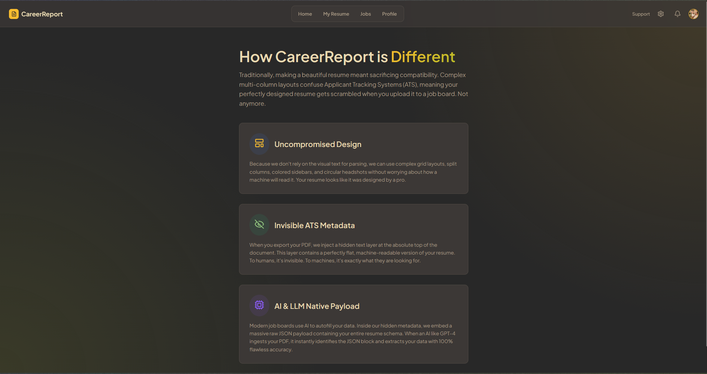

# CareerReport

<p align="center">
  
  
</p>

<p align="center">
  <strong>CareerReport</strong> is a state-of-the-art professional networking platform and resume builder designed for the next generation. Build stunning, pixel-perfect, ATS-friendly resumes, claim your custom public profile, and network in a sleek, business-first environment.
</p>

<p align="center">
  <a href="#-core-innovations"></a>
  <a href="#-tech-stack"></a>
  <a href="#-testing-architecture"></a>
</p>

---

## 🚀 Core Innovations & Recent Accomplishments

### 📏 1. Fluid Multi-Page Pagination Engine
One of the most notorious challenges in web engineering is converting responsive DOM nodes into pixel-perfect, multi-page PDFs without awkward page breaks or trailing blank spaces. CareerReport solves this with a custom-engineered **dynamic horizontal layout parser**:
* **CSS Columns Flow:** The editor renders a hidden, high-fidelity measurement container (`measureRef`) utilizing native CSS columns.
* **Scroll-Width Measurement:** As the user typing overflows the first standard Letter canvas (850px), the content flows naturally into next horizontal columns. We dynamically calculate the precise page count using:
  $$\text{Page Count} = \max\left(1, \text{round}\left(\frac{\text{Scroll Width} + 40}{890}\right)\right)$$
* **Pixel-Perfect Scaling:** Supports real-time layout adjustments, margins, templates, and font scaling factor configurations, automatically re-measuring when fonts finish loading (`document.fonts.ready`).
* **Zero Phantom Pages:** This technique completely eliminates visual layout gaps, ensuring the exported PDF matches the print-media boundaries exactly.

### 🤖 2. Invisible ATS & AI Metadata Layer (`AtsMetadata.tsx`)
Stunning, heavily styled, and multi-column resumes often fail enterprise Applicant Tracking Systems (ATS) and AI search indexers that rely on naive text flow analysis. 
* We inject a structured, high-fidelity **semantic metadata payload** directly into the resume DOM tree.
* **Double-Layer Extraction:**
  1. **Plaintext Summaries:** Standardized headers like `=== MACHINE READABLE RESUME DATA ===` outline your work, education, and skills.
  2. **Raw JSON Payload:** A fully serialized JSON-LD block (`=== RAW JSON PAYLOAD FOR AI EXTRACTORS ===`) for programmatic extraction by AI agents.
* **Visually Invisible, Programmatically Clear:** Styled via absolute positioning, $1\text{px}$ dimension gates, color transparency, and sub-pixel opacity. Screen readers and automated PDF text extractors pick it up flawlessly while human eyes only see the premium layout templates.

### 🧠 3. Advanced Context-Aware AI Suite
* **Zero-Cold-Start AI PDF Parser:** Import existing PDF resumes instantly. The server parses text, decompresses structure, and feeds structured tokens to Google Gemini to populate all profile fields in seconds.
* **Career Context Prompt:** Users can set a global "Career Context Prompt" (e.g., *"Senior Staff Engineer targeting early-stage YC startups with high-impact, concise bullet points"*). This dynamically primes all AI writing assistants, tailoring professional summary rewrites, job bullets, and category skill generation.

### 💬 4. Professional Social Networking Suite
Transitioned from a single resume builder into a collaborative network with Clerk authentication and custom JWT-to-Supabase RLS token mapping:
* **Public Handles:** Claim a custom username (`/u/username`) that serves as a unified digital footprint featuring your public resume, follower counts, and posts.
* **Social Engagement:** A global activity feed supporting threaded comments, real-time likes, and notifications dropdowns for incoming follows and post interactions.
* **Quote Reposting Modal:** Reshare network thoughts with integrated confirmation gates and nested content validation.
* **Follower Mechanics:** Follow peers and grow your circle, managed with robust Supabase relational integrity.
* **Private Direct Messages:** Seamless direct message portal with real-time syncing so recruiters and professionals can connect immediately.

---

## ✨ Features Breakdown

### 📝 Advanced Resume Builder
- **Real-Time Visual Editor:** Instantly edit and preview your resume exactly as it will appear when exported.
- **Dynamic Templates:** Seamlessly switch between Modern, Split, Minimal, and Classic layouts without losing data.
- **Autosave & Cloud Sync:** Your progress is continuously saved to the cloud via Supabase.
- **Total Customization:** Control section visibility, column counts, custom overrides, and custom image crops directly in the browser.

### 🔒 Security & Architecture
- **Authentication:** Passwordless, social, and standard login flows powered by Clerk.
- **True Singleton Supabase Client:** Memory-leak-free database connections with custom JWT interceptors for seamless Clerk synchronization.
- **Row-Level Security:** Supabase RLS policies enforce per-user data isolation across resumes, posts, likes, comments, and followers.
- **SSR-Safe:** Next.js Server-Side Rendering compatible token decoding using Node `Buffer` fallbacks.

---

## 🛠 Tech Stack

| Technology | Role in CareerReport |
| :--- | :--- |
| **Framework** | [Next.js](https://nextjs.org/) (App Router, Server Actions) |
| **Authentication** | [Clerk](https://clerk.com/) (Session management, JWT integration) |
| **Database** | [Supabase](https://supabase.com/) (PostgreSQL + granular Row-Level Security) |
| **AI Engine** | [Google Gemini API](https://ai.google.dev/) (PDF Parsing, Contextual Synthesis) |
| **Animations** | [@formkit/auto-animate](https://auto-animate.formkit.com/) (Micro-interactions) |
| **Styling** | Custom Vanilla CSS (HSL styling systems, Gruvbox theme variables) |
| **Icons** | [Lucide React](https://lucide.dev/) |

---

## 🧪 Testing Architecture

We follow a **"Diamond" testing strategy** to ensure full stability during rapid updates.

> [!TIP]
> **Unit Tests (`/tests/unit`)**: Using [Vitest](https://vitest.dev/), we cover pure utility algorithms like the AI Context Compressor, schema validations, and math parsers. Run with `npm run test`.
> 
> **E2E Tests (`/tests/e2e`)**: Using [Playwright](https://playwright.dev/), we test the core UI workflows such as building a resume, PDF export scaling, and social messaging pipelines. Run with `npm run test:e2e`.

*Note on E2E Auth:* Playwright is fully integrated with `@clerk/testing` to bypass bot protection. Credentials and instructions are located in the [CONTRIBUTING.md](./CONTRIBUTING.md) file.

---

## 🚀 Getting Started

### Prerequisites
- Node.js 18+ 
- npm / yarn / pnpm

### Installation

1. **Clone the repository:**
   ```bash
   git clone https://github.com/Azteriisk/CareerReport.git
   cd CareerReport
   ```

2. **Install dependencies:**
   ```bash
   npm install
   ```

3. **Set up environment variables:**
   Copy `.env.example` to `.env.local` and add your Clerk, Supabase, and Gemini API keys.
   ```bash
   cp .env.example .env.local
   ```

4. **Run the development server:**
   ```bash
   npm run dev
   ```

5. **Open browser:** Navigate to [http://localhost:3000](http://localhost:3000) to view CareerReport locally.

---

## 📝 License

This project is licensed under the MIT License.

